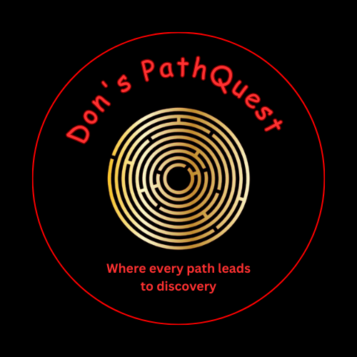

# Don's PathQuest 🚀  
*Where every path leads to discovery.*

Don's PathQuest is a visual pathfinding game built with Python and Pygame. This interactive project demonstrates how algorithms like A* (A-Star) can be used to explore the shortest path between two points in a grid-based world. Whether you're an algorithm enthusiast, a game developer, or a curious learner, this project invites you to dive into the world of search strategies and intelligent navigation.

  

---

## 🎮 Features

- 🔎 **Interactive Grid Interface**: Build barriers and choose start/end points with just a click.
- ⚙️ **Real-time A* Algorithm Visualization**: Watch the algorithm in action as it explores paths.
- 🧱 **Barrier Placement**: Set up custom obstacles to challenge the pathfinder.
- ⌨️ **Simple Controls**:
  - Left Click: Set Start, End, or Barriers
  - Right Click: Remove Start, End, or Barriers
  - `Spacebar`: Run the A* pathfinding algorithm
  - `C`: Clear the grid

  

---

## 🧠 Tech Stack

- **Python 3**
- **Pygame** (for rendering the grid and handling input)

---

## 🧭 How It Works

The A* algorithm uses a priority queue and heuristic (Manhattan distance) to determine the most efficient path. The grid is updated in real-time, showing explored nodes, open paths, and the final shortest path once discovered.

---

## 🚀 Getting Started

### 🔧 Requirements

- Python 3.x
- `pygame` library

  

---

